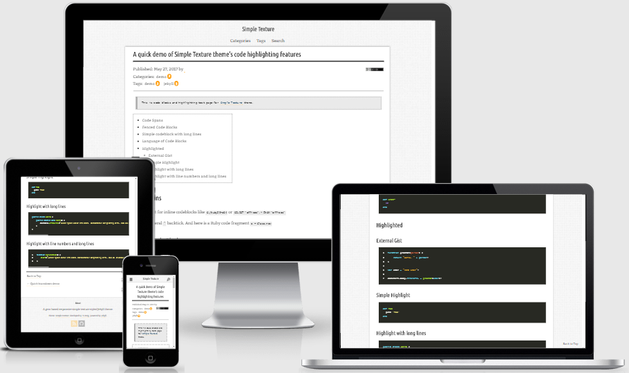

# Simple Texture Jekyll Theme


Simple Texture is a gem-based responsive simple texture styled Jekyll theme for [Jekyll][Jekyll] 3.3 or above,
which can also be forked as a boilerplate for older versions of Jekyll.

## Demo

- Starter-kit demo:
<https://yizeng.github.io/jekyll-theme-simple-texture/>
- My own personal blog: <https://yizeng.me/blog>




## Installation

### As a Jekyll theme gem (Jekyll >= 3.3)

If you are creating a new website or blog,
please follow the commands below first:

1. Install Jekyll and [Bundler][Bundler]

       gem install jekyll bundler

2. Create a new Jekyll app

       jekyll new jekyllapp

3. Enter the new directory

       cd jekyllapp

4. Then follow the instructions below like existing Jekyll app.

Then for existing Jekyll apps,

1. Install Bundler if haven't done so.

       gem install bundler

1. Remove Jekyll auto-generated default pages `404.html`, `about.markdown` and `index.markdown` or any your custom layouts or existing theme files.

1. Remove the existing `Gemfile.lock`.

1. Download the respository [here](https://github.com/yizeng/jekyll-theme-simple-texture/archive/master.zip)
and locate `starter-kit` folder,
or download `starter-kit` folder directly [here](https://minhaskamal.github.io/DownGit/#/home?url=https://github.com/yizeng/jekyll-theme-simple-texture/tree/master/starter-kit).

1. Put everything in the `starter-kit` in the root directory,
i.e. `jekyllapp` in this example.

1. Run `bundle install` to install dependencies.

1. Run Jekyll with `bundle exec jekyll serve`

1. Hack away at <http://localhost:4000>!

### As a fork

1. Fork the repo [here](https://github.com/yizeng/jekyll-theme-simple-texture#fork-destination-box)

2. Clone the repo just forked.

       git clone git@github.com:[YOUR_USERNAME]/jekyll-theme-simple-texture.git

3. Delete `starter-kit` folder and `jekyll-theme-simple-texture.gemspec` file (they're for people installing via gem)

4. Install Bundler if haven't done so.

       gem install bundler

5. Update the `Gemfile` to look like the following:

   ```ruby
   source "https://rubygems.org"

   gem "github-pages", group: :jekyll_plugins
   ```

6. Run `bundle install` to install dependencies.

7. Run Jekyll with `bundle exec jekyll serve`

8. Hack away at <http://localhost:4000>!

## Contributing

Bug reports and pull requests are welcome on GitHub at <https://github.com/yizeng/jekyll-theme-simple-texture>. This project is intended to be a safe, welcoming space for collaboration, and contributors are expected to adhere to the [Contributor Covenant](http://contributor-covenant.org) code of conduct.

## Credits

- [Jekyll][Jekyll]
  + [jekyll-feed](https://github.com/jekyll/jekyll-feed)
  + [jekyll-redirect-from](https://github.com/jekyll/jekyll-redirect-from)
  + [jekyll-seo-tag](https://github.com/jekyll/jekyll-seo-tag)
  + [jekyll-sitemap](https://github.com/jekyll/jekyll-sitemap)
  + [Simple-Jekyll-Search](https://github.com/christian-fei/Simple-Jekyll-Search)
  + [Jekyll-Bootstrap](http://jekyllbootstrap.com/)
  + [theme-the-program](https://github.com/jekyllbootstrap/theme-the-program)

- [Sass](http://sass-lang.com/)
  + [Normalize.css](https://necolas.github.io/normalize.css/)
  + [Animate.css](https://daneden.github.io/animate.css/)
  + [Simple Icons](https://simpleicons.org/)
  + [Noise Texture Generator](http://www.noisetexturegenerator.com/)
- JavaScript
  + [cdnjs](https://cdnjs.com/)
  + [jQuery](https://jquery.com/)
  + [fullPage.js](https://alvarotrigo.com/fullPage/)
  + [pace.js](http://github.hubspot.com/pace/docs/welcome/)
  + [Modernizr](https://modernizr.com/)
  + [FancyBox](http://fancybox.net/)
  + [unveil.js](http://luis-almeida.github.io/unveil/)
- Fonts
  + [Font Squirrel](https://www.fontsquirrel.com/)
  + [Bitter](https://fonts.google.com/specimen/Bitter)
  + [Junge](https://fonts.google.com/specimen/Junge)
  + [Ubuntu Condensed](https://fonts.google.com/specimen/Ubuntu+Condensed)

## License

The theme is available as open source under the terms of the
[MIT License](https://github.com/yizeng/jekyll-theme-simple-texture/blob/master/LICENSE).

    MIT License

    Copyright (c) 2017 Yi Zeng

    Permission is hereby granted, free of charge, to any person obtaining a copy
    of this software and associated documentation files (the "Software"), to deal
    in the Software without restriction, including without limitation the rights
    to use, copy, modify, merge, publish, distribute, sublicense, and/or sell
    copies of the Software, and to permit persons to whom the Software is
    furnished to do so, subject to the following conditions:

    The above copyright notice and this permission notice shall be included in all
    copies or substantial portions of the Software.

    THE SOFTWARE IS PROVIDED "AS IS", WITHOUT WARRANTY OF ANY KIND, EXPRESS OR
    IMPLIED, INCLUDING BUT NOT LIMITED TO THE WARRANTIES OF MERCHANTABILITY,
    FITNESS FOR A PARTICULAR PURPOSE AND NONINFRINGEMENT. IN NO EVENT SHALL THE
    AUTHORS OR COPYRIGHT HOLDERS BE LIABLE FOR ANY CLAIM, DAMAGES OR OTHER
    LIABILITY, WHETHER IN AN ACTION OF CONTRACT, TORT OR OTHERWISE, ARISING FROM,
    OUT OF OR IN CONNECTION WITH THE SOFTWARE OR THE USE OR OTHER DEALINGS IN THE
    SOFTWARE.

[Jekyll]: http://jekyllrb.com/
[Bundler]: https://bundler.io/
